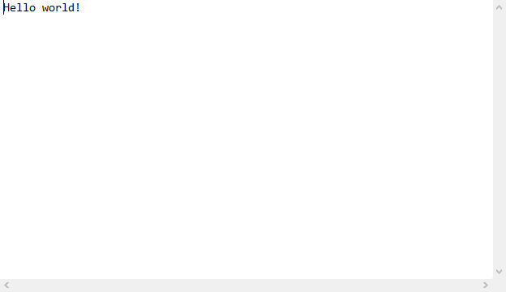

---
# Front matter
lang: ru-RU
title: "Лабораторная работа № 1"
subtitle: "Знакомство с Git"
author: "Сухарев Кирилл"

# Formatting
toc-title: "Содержание"
toc: true # Table of contents
toc_depth: 2
lof: true # List of figures
lot: true # List of tables
fontsize: 12pt
linestretch: 1.5
papersize: a4paper
documentclass: scrreprt
polyglossia-lang: russian
polyglossia-otherlangs: english
mainfont: PT Serif
romanfont: PT Serif
sansfont: PT Sans
monofont: PT Mono
mainfontoptions: Ligatures=TeX
romanfontoptions: Ligatures=TeX
sansfontoptions: Ligatures=TeX,Scale=MatchLowercase
monofontoptions: Scale=MatchLowercase
indent: true
pdf-engine: lualatex
header-includes:
  - \linepenalty=10 # the penalty added to the badness of each line within a paragraph (no associated penalty node) Increasing the value makes tex try to have fewer lines in the paragraph.
  - \interlinepenalty=0 # value of the penalty (node) added after each line of a paragraph.
  - \hyphenpenalty=50 # the penalty for line breaking at an automatically inserted hyphen
  - \exhyphenpenalty=50 # the penalty for line breaking at an explicit hyphen
  - \binoppenalty=700 # the penalty for breaking a line at a binary operator
  - \relpenalty=500 # the penalty for breaking a line at a relation
  - \clubpenalty=150 # extra penalty for breaking after first line of a paragraph
  - \widowpenalty=150 # extra penalty for breaking before last line of a paragraph
  - \displaywidowpenalty=50 # extra penalty for breaking before last line before a display math
  - \brokenpenalty=100 # extra penalty for page breaking after a hyphenated line
  - \predisplaypenalty=10000 # penalty for breaking before a display
  - \postdisplaypenalty=0 # penalty for breaking after a display
  - \floatingpenalty = 20000 # penalty for splitting an insertion (can only be split footnote in standard LaTeX)
  - \raggedbottom # or \flushbottom
  - \usepackage{float} # keep figures where there are in the text
  - \floatplacement{figure}{H} # keep figures where there are in the text
---

# Цель работы

Знакомство с системой контроля версий Git

# Задание

Развернуть git-репозиторий и выполнить некоторые действия.

# Выполнение лабораторной работы

1. Git использовался мною ранее, поэтому этап авторизации опускаю.

2. Установим окончание строк и отображение Unicode (Figure -@fig:001).

3. Создадим проект в каталоге mathmod (При выполнении работы я не обратил внимания на его имя, поэтому назвал по-своему). Затем создадим в нем html-страничку hello.html (Figure -@fig:002).

4. Инициализируем git-репозиторий в этом каталоге, и добавим нашу страничку в этот репозиторий. Проверим состояние репозитория (Figure -@fig:003).

5. Сделаем текст нашей html-страницы заголовком первого уровня. Проверим состояние рабочего каталога (Figure -@fig:004).

6. Воспользуемся командой git add, чтобы проиндексировать изменения. Просмотрев состояние репозитория, увидим, что строка hello.html изменила цвет с красного на зеленый (Figure -@fig:005).

7. Совершим коммит, используя команду git commit. В открывшемся редакторе укажем комментарий. Проверим состояние еще раз - рабочий каталог очистился, значит все изменения сохранились (Figure -@fig:006).

8. Добавим стандартую html-разметку, кроме тега head. Проиндексируем изменения и проверим статус репозитория (Figure -@fig:007).

9. Добавим тег head и снова проверим статус (Figure -@fig:008). Видим, что файл hello.html в состоянии указан дважды.

10. Выполним коммит. В статусе репозитория видим, что второе изменение файла hello.html все еще не проиндексировано (Figure -@fig:009).

11. Проиндексируем и закоммитим это изменение (Figure -@fig:010).

12. Получим список всех коммитов командой git log. Выведем этот список в однострочном формате (Figure -@fig:011)

13. Мною были выполнены основные действия с ситемой контроля версий Git. Остальные действия вы можете увидеть в youtube-ролике по ссылке: https://youtu.be/-FsRwkyyG_0

{ #fig:001 width=100% }

{ #fig:002 width=100% }

{ #fig:003 width=100% }

{ #fig:004 width=100% }

{ #fig:005 width=100% }

{ #fig:006 width=100% }

{ #fig:007 width=100% }

{ #fig:008 width=100% }

{ #fig:009 width=100% }

{ #fig:010 width=100% }

{ #fig:011 width=100% }

# Выводы

Git - мощнейшая система контроля версий, позволяющая работать над проектом множеству людей, отслеживая изменения каждого