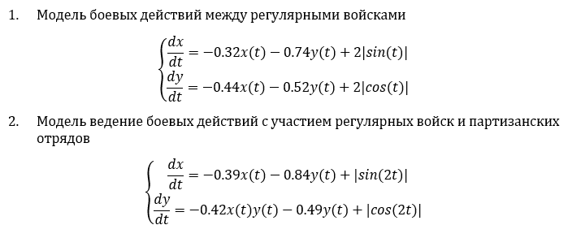
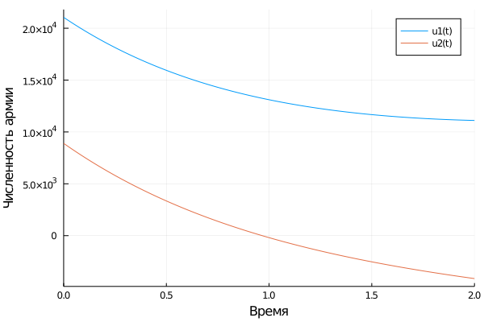

---
## Front matter
lang: ru-RU
title: "Лабораторная работа № 3"
subtitle: "Модель боевых действий"
author: "Сухарев Кирилл"

## Formatting
toc: false
slide_level: 2
theme: metropolis
header-includes: 
 - \metroset{progressbar=frametitle,sectionpage=progressbar,numbering=fraction}
 - '\makeatletter'
 - '\beamer@ignorenonframefalse'
 - '\makeatother'
aspectratio: 43
section-titles: true
---

## Задание

{ #fig:001 width=100% }

## Код программы

{ #fig:002 width=100% }

## Первая модель

{ #fig:003 width=100% }

## Вторая модель

{ #fig:004 width=100% }

## Итоговая модель 

{ #fig:005 width=100% }