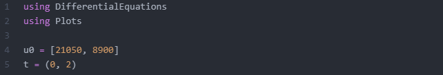
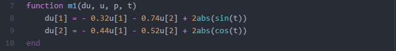
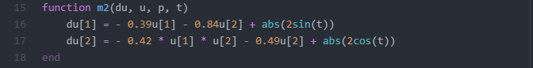
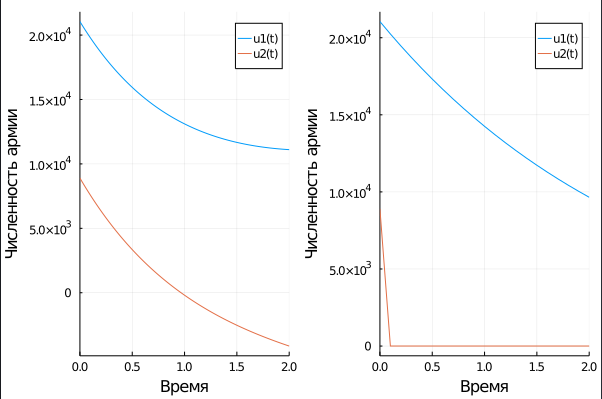
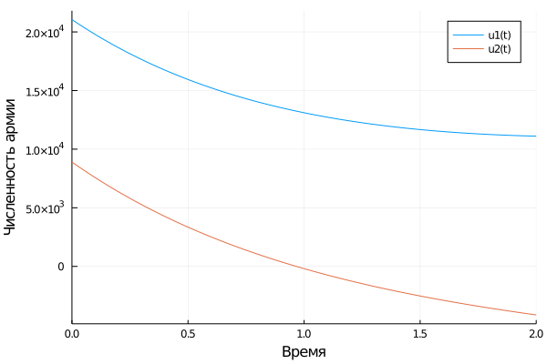
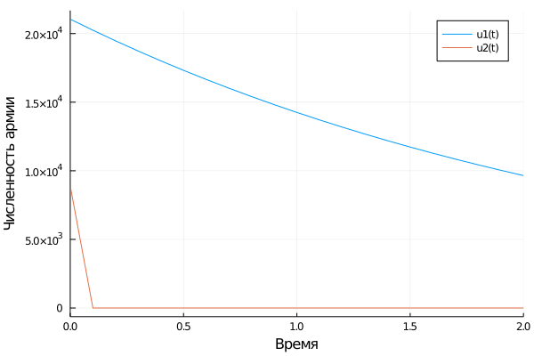
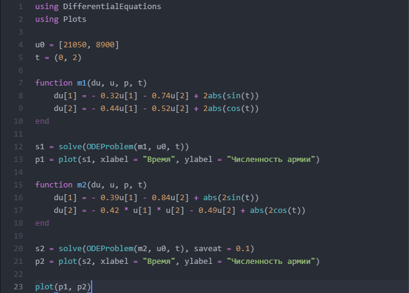

---
# Front matter
lang: ru-RU
title: "Лабораторная работа № 3"
subtitle: "Модель боевых действий"
author: "Сухарев Кирилл"

# Formatting
toc-title: "Содержание"
toc: true
toc_depth: 2
lof: true
lot: true
fontsize: 12pt
linestretch: 1.5
papersize: a4paper
documentclass: scrreprt
polyglossia-lang: russian
polyglossia-otherlangs: english
mainfont: PT Serif
romanfont: PT Serif
sansfont: PT Sans
monofont: PT Mono
mainfontoptions: Ligatures=TeX
romanfontoptions: Ligatures=TeX
sansfontoptions: Ligatures=TeX,Scale=MatchLowercase
monofontoptions: Scale=MatchLowercase
indent: true
pdf-engine: lualatex
header-includes:
  - \linepenalty=10
  - \interlinepenalty=0
  - \hyphenpenalty=50
  - \exhyphenpenalty=50
  - \binoppenalty=700
  - \relpenalty=500
  - \clubpenalty=150
  - \widowpenalty=150
  - \displaywidowpenalty=50
  - \brokenpenalty=100
  - \predisplaypenalty=10000
  - \postdisplaypenalty=0
  - \floatingpenalty = 20000
  - \usepackage{float}
  - \floatplacement{figure}{H}t
---

# Теоретическое введение

Одной из простейших моделей боевых действий является **модель Ланчестера**. Основной характеристикой соперников будем считать численность армии сторон. Если в определенный момент времени численность армии одной из сторон обращается в ноль, то такая сторона считается проигравшей.

Рассмотрим два случая ведения боевых действий:

1. Боевые действия между регулярными войсками

2. Боевые действия с участием регулярных войск и партизанских отрядов

В первом случае на число регулярных войск влиет три фактора:

* Скорость уменьшения численности войск из-за причин, не связанных с боевыми действиями

* Скорость уменьшения численности войск из-за боевых действий

* Скорость поступления подкрепления

В данном случае модель боевых действий можно описать следующей системой обыкновенных дифференциальных уравнений

$$\left\{\begin{matrix} \frac{dx}{dt}=-a(t)x(t)-b(t)y(t)+P(t) \\ \frac{dy}{dt}=-c(t)x(t)-h(t)y(t)+Q(t) \end{matrix}\right.$$

В данной системе $a(t)$ и $h(t)$ - коэффициенты, влияющие на потери, не связанные с боевыми действиями; $b(t)$ и $c(t)$ - коэффициенты эффективности боевых действий второй и первой армии соответственно. Функции $P(t)$ и $Q(t)$ определяют возможность поступления подкрепления к первой и второй армии соответственно в течение дня.

Второй случай учитывает партизанские отряды. Из-за того, что они действуют более скрытно, сопернику приходится действовать по площади, занимаемой партизанами. А значит можно говорить, что потери партизан, проводящих свои операции в разных местах на некоторой известной территории, пропорциональны не только количеству регулярных войск, но и количеству самих партизан.

Таким образом, система примет следующий вид:

$$\left\{\begin{matrix} \frac{dx}{dt}=-a(t)x(t)-b(t)y(t)+P(t) \\ \frac{dy}{dt}=-c(t)x(t)y(t)-h(t)y(t)+Q(t) \end{matrix}\right.$$

Все величины здесь имеют тот же смысл, что и ранее.

Решение данной системы будет отражать численность армии с течением времени

# Задание

**Вариант 39**

Между страной Х и страной У идет война. Численность состава войск исчисляется от начала войны, и являются временными функциями $x(t)$ и $y(t)$. В начальный момент времени страна Х имеет армию численностью 21 050 человек, а в распоряжении страны У армия численностью в 8 900 человек. Для упрощения модели считаем, что коэффициенты  $a$, $b$, $c$, $h$ постоянны. Также считаем $P(t)$ и $Q(t)$ непрерывные функции.

Постройте графики изменения численности войск армии Х и армии У для следующих случаев:

1. Модель боевых действий между регулярными войсками

$$\left\{\begin{matrix} \frac{dx}{dt}=-0.32x(t)-0.74y(t)+2|sin(t)| \\ \frac{dy}{dt}=-0.44x(t)-0.52y(t)+2|cos(t)| \end{matrix}\right.$$

2. Модель ведение боевых действий с участием регулярных войск и партизанских отрядов

$$\left\{\begin{matrix} \frac{dx}{dt}=-0.39x(t)-0.84y(t)+|sin(2t)| \\ \frac{dy}{dt}=-0.42x(t)y(t)-0.49y(t)+|cos(2t)| \end{matrix}\right.$$

# Выполнение лабораторной работы

1. Код будем писать на языке Julia. Подключим необходимые библиотеки и зададим начальные условия (Figure -@fig:001)

{ #fig:001 width=100% }

2. Напишем функцию, определяющую систему ОДУ, заданную первым случаем (Figure -@fig:002).

{ #fig:002 width=100% }

3. Решим эту систему и построим графическое отображение решения (Figure -@fig:003).

{ #fig:003 width=100% }

4. Напишем функцию, определяющую систему ОДУ, заданную вторым случаем (Figure -@fig:004).

{ #fig:004 width=100% }

5. Решим эту систему и построим графическое отображение решения (Figure -@fig:005). При решении явно укажем шаг функции. Это необходимо сделать, так как по умолчанию шаг слишком мал, и график одной из функций убывает так быстро, что невооруженным глазом это трудно заметить.

{ #fig:005 width=100% }

6. Выведем одновременно графические решения, выполненные в предыдущих пунктах (Figure -@fig:006)

{ #fig:006 width=100% }

{ #fig:007 width=100% }

{ #fig:008 width=100% }

{ #fig:009 width=100% }

# Выводы

Рассмотренные простейшие модели соперничества соответствуют системам обыкновенных дифференциальных уравнений второго порядка, широко распространенным при описании многих естественно-научных объектов.