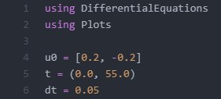

---
# Front matter
lang: ru-RU
title: "Лабораторная работа № 4"
subtitle: "Модель гармонических колебаний"
author: "Сухарев Кирилл"

# Formatting
toc-title: "Содержание"
toc: true
toc_depth: 2
lof: true
lot: true
fontsize: 12pt
linestretch: 1.5
papersize: a4paper
documentclass: scrreprt
polyglossia-lang: russian
polyglossia-otherlangs: english
mainfont: PT Serif
romanfont: PT Serif
sansfont: PT Sans
monofont: PT Mono
mainfontoptions: Ligatures=TeX
romanfontoptions: Ligatures=TeX
sansfontoptions: Ligatures=TeX,Scale=MatchLowercase
monofontoptions: Scale=MatchLowercase
indent: true
pdf-engine: lualatex
header-includes:
  - \linepenalty=10
  - \interlinepenalty=0
  - \hyphenpenalty=50
  - \exhyphenpenalty=50
  - \binoppenalty=700
  - \relpenalty=500
  - \clubpenalty=150
  - \widowpenalty=150
  - \displaywidowpenalty=50
  - \brokenpenalty=100
  - \predisplaypenalty=10000
  - \postdisplaypenalty=0
  - \floatingpenalty = 20000
  - \usepackage{float}
  - \floatplacement{figure}{H}t
---

# Теоретическое введение

Движение грузика на пружинке, маятника, заряда в электрическом контуре, а также эволюция во времени многих систем в физике, химии, биологии и других науках при определенных предположениях можно описать одним и тем же дифференциальным уравнением, которое в теории колебаний выступает в качестве основной модели. Эта модель называется линейным гармоническим осциллятором.

Уравнение свободных колебаний гармонического осциллятора имеет следующий вид:

$$\ddot{x} + 2\gamma \dot{x} + \omega_0^2x = 0$$

Здесь $x$ – переменная, описывающая состояние системы (смещение грузика, заряд конденсатора и т.д.), $\gamma$ – параметр, характеризующий потери энергии (трение в механической системе, сопротивление в контуре), $\omega_0$ – собственная частота колебаний, $t$ – время. ($\ddot{x} = \frac {\partial^2x}{\partial t^2}, \dot{x} = \frac {\partial x}{\partial t}$)

Данное уравнение есть линейное однородное дифференциальное уравнение второго порядка и оно является примером линейной динамической системы. Его можно представить в виде системы двух уравнений первого порядка:

$$ \left \{\begin{matrix} \dot{x} = y \\ \dot{y} = -2\gamma \dot{x} -\omega_0^2x \end{matrix}\right.$$

Независимые переменные x, y определяют пространство, в котором «движется» решение. Это фазовое пространство системы, поскольку оно двумерно будем называть его фазовой плоскостью.

Значение фазовых координат x, y в любой момент времени полностью определяет состояние системы. Решению уравнения движения как функции времени отвечает гладкая кривая в фазовой  лоскости. Она называется фазовой траекторией. Если множество различных решений (соответствующих различным начальным условиям) изобразить на одной фазовой плоскости, возникает общая картина поведения системы. Такую картину, образованную набором фазовых траекторий, называют фазовым портретом.

# Задание

**Вариант 39**

Постройте фазовый портрет гармонического осциллятора и решение уравнения гармонического осциллятора для следующих случаев

1. Колебания гармонического осциллятора без затуханий и без действий внешней силы

$$\dot{x} + 1.2x = 0$$

2. Колебания гармонического осциллятора c затуханием и без действий внешней силы

$$\ddot{x} + 2\dot{x} + 4.3x = 0$$

3. Колебания гармонического осциллятора c затуханием и под действием внешней силы

$$\ddot{x} + 7.4\dot{x} + 7.5x = 2.2cos(0.6t)$$

На интервале $t\in [0; 55]$ (шаг 0.05) с начальными условиями $x_0 = 0.2, y_0 = -0.2$

# Выполнение лабораторной работы

1. Код будем писать на языке Julia. Подключим необходимые библиотеки и зададим начальные условия (Figure -@fig:001)

{ #fig:001 width=100% }

2. Напишем функцию, определяющую систему ОДУ, заданную первым случаем (Figure -@fig:002).

{ #fig:002 width=100% }

3. Напишем функцию, определяющую систему ОДУ, заданную вторым случаем (Figure -@fig:003).

{ #fig:003 width=100% }

4. Напишем функцию, определяющую систему ОДУ, заданную третьим случаем (Figure -@fig:004).

{ #fig:004 width=100% }

5. Решим эти систему и построим графическое отображение решения (Figure -@fig:005).

{ #fig:005 width=100% }

{ #fig:006 width=100% }

# Контрольные вопросы

1. Запишите простейшую модель гармонических колебаний

$$\ddot{x} + 2\gamma \dot{x} + \omega_0^2x = 0$$

2. Дайте определение осциллятора

Осциллятор - система, совершающая колебания, то есть показатели которой периодически повторяются во времени. 

3. Запишите модель математического маятника

$$\ddot{x} + \omega_0^2x = 0$$

4.  Запишите алгоритм перехода от дифференциального уравнения второго порядка к двум дифференциальным уравнениям первого порядка

Пусть ДУ второго порядка имеет вид: $A\ddot{x} + B\dot{x} + C\omega_0^2x = P(t)$. Тогда система из двух ДУ первого порядка будет выглядеть так:

$$ \left \{\begin{matrix} \dot{x} = y \\ \dot{y} = \frac{-B\dot{x} - Cx - P(t)}{A} \end{matrix}\right.$$

5. Что такое фазовый портрет и фазовая траектория?

Фазовая траектория - кривая в фазовом пространстве, составленная из точек, представляющих состояние динамической системы в последовательные моменты времени в течение всего времени эволюции.

Фазовый портрет - геометрическое представление траекторий динамической системы в фазовой плоскости.

# Выводы

Рассмотренные простейшие модели гармонических колебаний соответствуют дифференциальным уравнениям второго порядка, которые можно представить в виде системы двух дифференциальным уравнениям первого порядка.