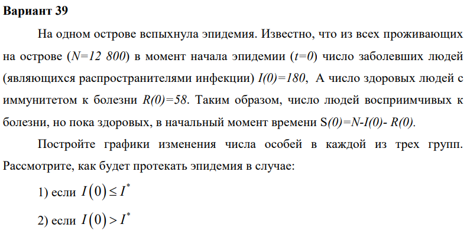
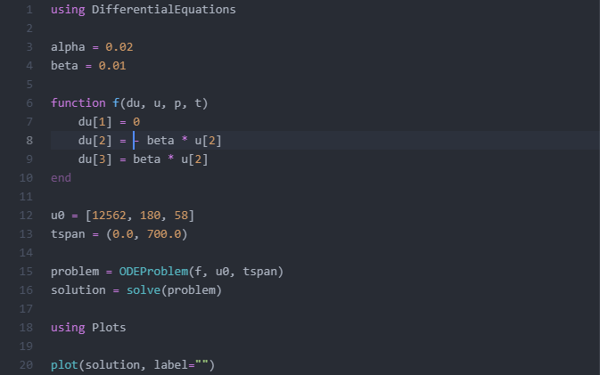
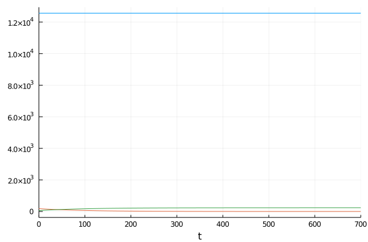
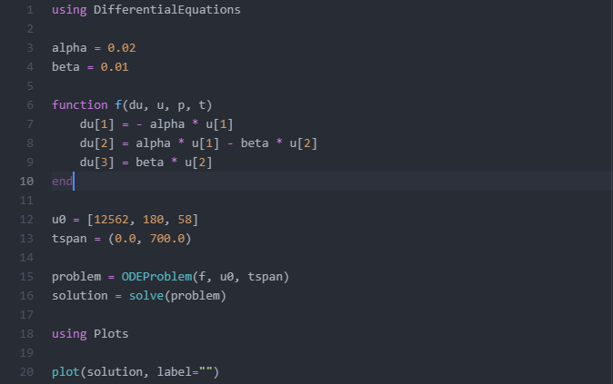
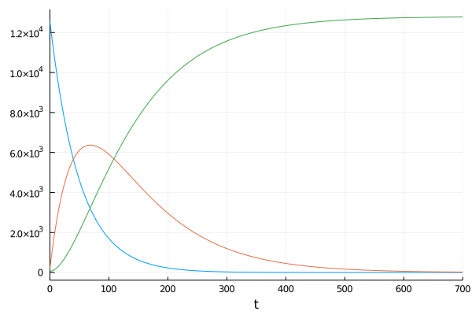

---
## Front matter
lang: ru-RU
title: "Лабораторная работа № 6"
subtitle: "Задача об эпидемии"
author: "Сухарев Кирилл"

## Formatting
toc: false
slide_level: 2
theme: metropolis
header-includes: 
 - \metroset{progressbar=frametitle,sectionpage=progressbar,numbering=fraction}
 - '\makeatletter'
 - '\beamer@ignorenonframefalse'
 - '\makeatother'
aspectratio: 43
section-titles: true
---

## Задание

{ #fig:001 width=100% }

## Код программы для первого случая

{ #fig:002 width=60% }

## График для первого случая

{ #fig:003 width=100% }

## Код программы для второго случая

{ #fig:004 width=100% }

## График для второго случая

{ #fig:005 width=100% }