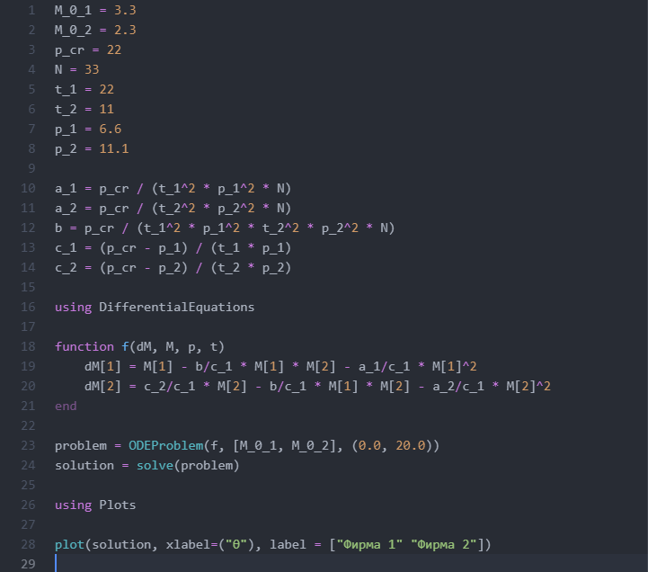
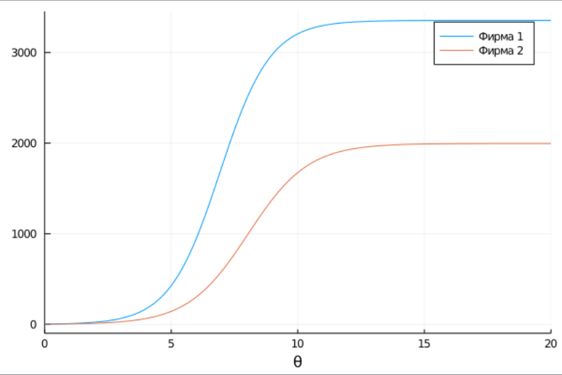
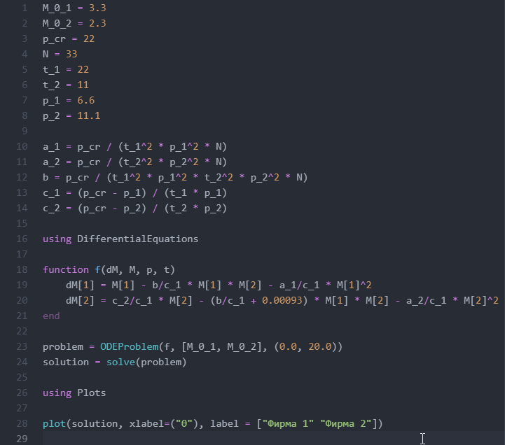
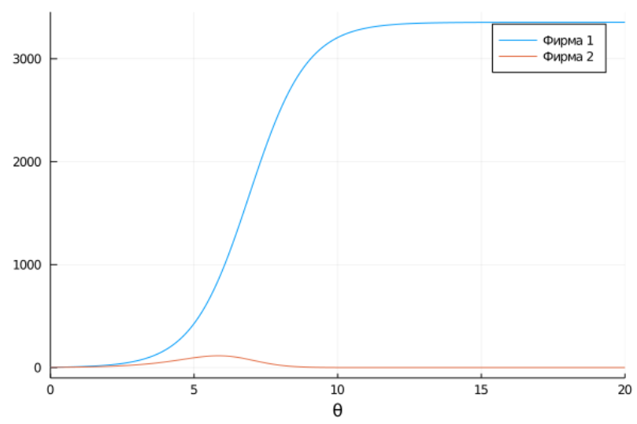

---
## Front matter
lang: ru-RU
title: "Лабораторная работа № 8"
subtitle: "Модель конкуренции двух фирм"
author: "Сухарев Кирилл"

## Formatting
toc: false
slide_level: 2
theme: metropolis
header-includes: 
 - \metroset{progressbar=frametitle,sectionpage=progressbar,numbering=fraction}
 - '\makeatletter'
 - '\beamer@ignorenonframefalse'
 - '\makeatother'
aspectratio: 43
section-titles: true
---

## Задание

**Вариант 39**

1. Постройте графики изменения оборотных средств фирмы 1 и фирмы 2 без учета постоянных издержек и с веденной нормировкой для случая 1:

$$\left\{\begin{matrix} \frac{dM_1}{d\theta} = M_1 - \frac{b}{c_1} M_1 M_2 - \frac{a_1}{c_1} M_1^2 \\ \frac{dM_2}{d\theta} = \frac{c_2}{c_1} M_2 - \frac{b}{c_1} M_1 M_2 - \frac{a_2}{c_1} M_2^2 \end{matrix}\right.$$

2. Постройте графики изменения оборотных средств фирмы 1 и фирмы 2 без учета постоянных издержек и с веденной нормировкой для случая 2.

$$\left\{\begin{matrix} \frac{dM_1}{d\theta} = M_1 - \frac{b}{c_1} M_1 M_2 - \frac{a_1}{c_1} M_1^2 \\ \frac{dM_2}{d\theta} = \frac{c_2}{c_1} M_2 - (\frac{b}{c_1} + 0.00093) M_1 M_2 - \frac{a_2}{c_1} M_2^2 \end{matrix}\right.$$

Начальные условия:

$$M_0^1 = 3.3, M_0^2 = 2.3, p_{cr} = 22, N = 33, q = 1, \tau_1 = 22, \tau_2 = 11, \tilde{p_1} = 6.6, \tilde{p_2} = 11.1$$

***Замечание:*** Необходимо учесть, что значения $p_{cr}, \tilde{p_{1,2}}, N$ указаны в тысячах единиц (например $N = 10$ - означает 10 000 потенциальных потребителей), а значения $M_{1,2}$ указаны в млн. единиц

## Код программы для первого случая

{ #fig:001 width=100% }

## График для первого случая

{ #fig:002 width=100% }

## Код программы для второго случая

{ #fig:003 width=100% }

## График для второго случая

{ #fig:004 width=100% }